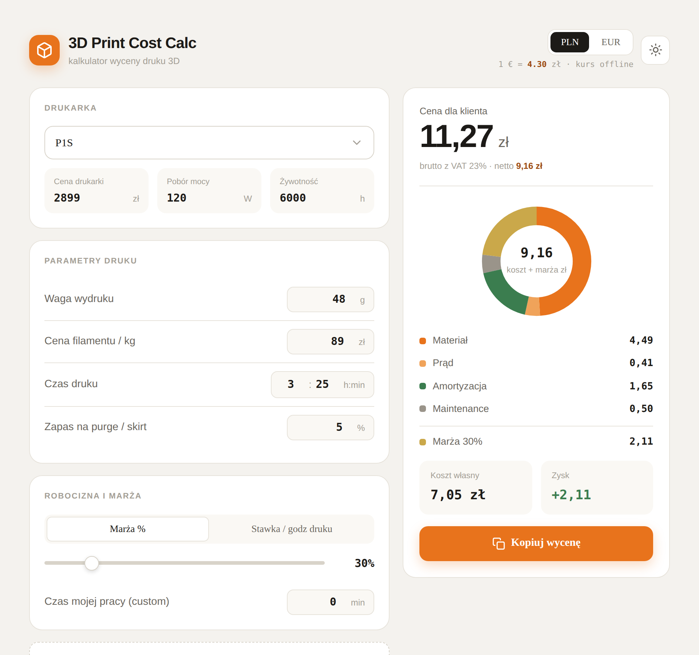

# 3D Print Cost Calc — kalkulator wyceny druku 3D

Policz, ile *naprawdę* kosztuje wydruk 3D — nie tylko filament, ale też prąd, amortyzację drukarki, eksploatację i marżę. Wszystko w jednym pliku HTML, bez instalacji, w przeglądarce.

**→ [Otwórz narzędzie na żywo](https://rafalr100.github.io/3dprint-cost-calc/)**



## Co to robi

Wpisujesz parametry wydruku i wybierasz drukarkę z listy, a narzędzie na żywo rozkłada cenę na czynniki pierwsze i pokazuje, ile na wydruku zarabiasz. Pomyślane dla hobbystów i osób dorabiających na druku, którzy chcą wyceniać świadomie, a nie „na oko".

## Funkcje

- **~20 popularnych drukarek** — Bambu Lab, Prusa, Creality, Anycubic. Wybór z listy podstawia cenę i pobór mocy; wszystko można nadpisać ręcznie. Jest też opcja własnej drukarki.
- **Pełne rozbicie kosztu** — materiał, prąd, amortyzacja, eksploatacja, robocizna, postprocessing, bufor na nieudane wydruki i marża, z wykresem kołowym.
- **Marża na dwa sposoby** — procent od kosztu albo stawka za godzinę druku.
- **PLN i EUR** — przelicznik z kursem pobieranym na żywo z Europejskiego Banku Centralnego.
- **VAT** — podgląd ceny netto i brutto.
- **Motyw jasny i ciemny.**
- **Kopiuj wycenę** — gotowe podsumowanie do schowka jednym kliknięciem.

## Jak liczona jest cena

```
cena_brutto = (materiał + prąd + amortyzacja + eksploatacja + robocizna + postprocessing)
              × (1 + ryzyko_awarii)
              + marża
              × (1 + VAT)
```

| Składnik | Jak liczony |
|---|---|
| Materiał | waga × cena filamentu za kg, plus zapas na purge/skirt |
| Prąd | pobór mocy drukarki × czas druku × cena kWh |
| Amortyzacja | cena drukarki rozłożona na jej żywotność w godzinach |
| Eksploatacja | stała kwota na zużywalne części (dysze, paski, smar) |
| Robocizna | czas własnej pracy × stawka godzinowa (projekty na zamówienie) |
| Marża | procent od kosztu lub stawka za godzinę druku |

### O założeniach

Amortyzację liczymy przez **żywotność drukarki w godzinach** (domyślnie 6000 h — środek rynkowego przedziału 3000–10000 h dla drukarek domowych), a nie sztywne „X lat". To uczciwiej odzwierciedla koszt na pojedynczy wydruk. Amortyzacja zwraca koszt *zakupu* maszyny; osobna pozycja eksploatacji pokrywa *zużywalne części*, których amortyzacja nie obejmuje.

Domyślne ceny i pobór mocy drukarek są **orientacyjne** — ceny rynkowe się zmieniają, więc każdą wartość można edytować pod własny sprzęt.

## Uruchomienie lokalne

Nie wymaga niczego poza przeglądarką:

```bash
git clone https://github.com/rafalr100/3dprint-cost-calc.git
cd 3dprint-cost-calc
python3 -m http.server 8000   # następnie otwórz http://localhost:8000
```

…albo po prostu otwórz `index.html` dwuklikiem.

## Pod maską

Czysty HTML, CSS i JavaScript — zero zależności i zero kroku budowania. Wykres kołowy rysowany ręcznie w SVG. Kurs walut z [Frankfurter API](https://www.frankfurter.app/) (dane ECB), z kursem zapasowym przy braku sieci. Fonty: Bricolage Grotesque, Hanken Grotesk, JetBrains Mono.

## Licencja

[MIT](LICENSE)
